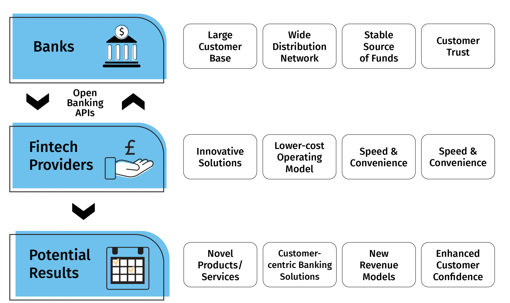
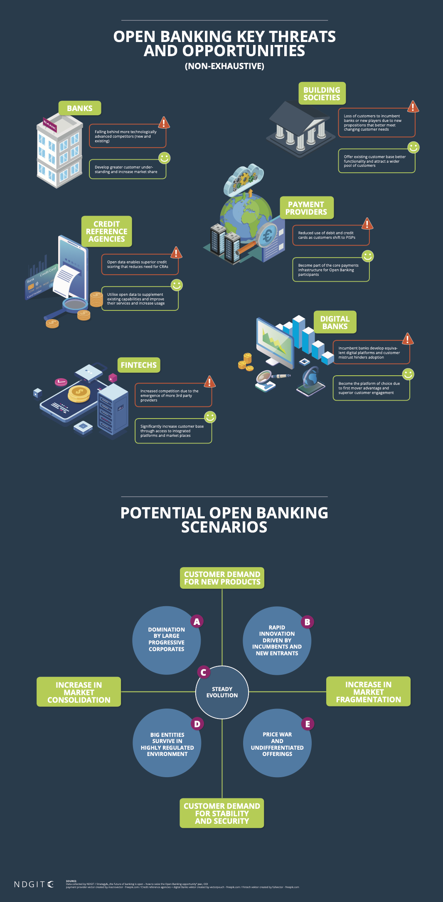

# FinTech-Mod1-Challenge
FinTech-Mod1-Challenge - Open Banking - Case Study

## Table of Contents

- [Sections](#sections)
  - [Overview and Origin](#title)
  - [Business Activities](#banner)
  - [Landscape](#badges)
  - [Results](#short-description)
  - [Recommendations](#long-description)
- [Sources](#Sources)  
  
## Sections

## Overview and Origin

Open banking is a method by which companies are able to offer safe exchange between established banks and third party service providers. By using Application Programming Interfaces (API's), a service provider can integrate their payment, investment tool, or any applicable finance application with all banks.

This case study will focus on the company named TIBCO. TIBCO was founded in 1997 by Vivek Ranadive. The name was derived from a description of the company's initial product (The Information Bus Company). The product it initially offered was software designed to communicate the activities of the financial markets in real-time without any human interaction. The idea was founded on the enhanced use of APIs to unlock financial data. The company was originally a subsidiary of a venture capitalist firm called Reuters Holdings. TIBCO success also followed its inclusion as one of the initial partners with Microsoft to deliver "push" technology to provide news and data for free through internet browsers. From there it has continued to flourish and expand through acquisitions.

After a going public in 1999, the company was acquired in 2014 by Vista Equity Partners and is now privately owned.

## Business Activities

Specifically with Open Banking, TIBCO is looking to enable its customers, usually large scale banks with the tools to stay current and attract new development. The benefits of Open Banking is typically a merging of the interests between traditional banks with a broad customer base and startups that have the agility to create competitive tools. As a result, finance consumers get customer centric tools, efficient use of data and enhanced trust as the technology rapidly changes.

The intended user would be banks that are looking to expand their customer base or strengthen their customer base with new advancements. According to a PwC [study](https://www.pwc.com/us/en/industries/financial-services/library/next-in-banking-capital-markets-trends.html?WT.mc_id=CT7-PL900-DM1-TR1-LS4-ND30-PRG7-CN_DataAndAnalyticsBuilds-NextInBakingCapitalMarketsTrendNativeNativo), across all US banks , consumers bring in slightly more than half of all revenue. Fintech will continue to drive customer expectations. So as opposed to growth through bank acquisitions, large banks could be challenged to focus on customer centric solutions that open banking might allow.

TIBCO has a substantial [history](https://www.tibco.com/resources/analyst-report/gartner-magic-quadrant-master-data-management-solutions) of enabling large enterprises access their operational data. It has a clear advantage because it has been a proven solution for large scale customers such as Vodafone, Delta Airlines. For Open Banking, TIBCO creates a platform that uses the latest languages for developers to build quick [on](https://www.tibco.com/reference-center/what-is-open-banking). One of their methods that makes, TIBCO unique is that they use a process known as data virtualization. With data virtualization customers pull data from existing stores on demand instead of move into a centralized data warehouse. Most competitors require their customers to engage in the transfer of their data to create a data lake without the additional step of exposing the APIs.

In order to create a platform that will work with legacy systems and data stores, TIBCO uses Open Database Connectivity (ODBC) from major vendors to create a connection on their server. Afterwards the TIBCO server translates those ODBC to more modern REST API endpoints. REST calls are a modern and efficient method to move data securely over the internet.

## Landscape

TIBCO is in the domain of Open Banking. In recent years it has mad further investment to establish more of a foothold within that field.

Within the last 5-10 years open banking has really taken off. Because its based in providing a platform for any number of developers several apps have room within the space to flourish. For example, there are apps that focus on managing investments like a RobinHood that can be easily tied to your bank account. There are apps that target payroll that link directly to your place of work's financial institution for faster release of funds. There are credit scoring apps that keep your credit score up to date with ties to your bank account. Lending apps can now be tailored and personalized thanks to the platform that open banking provides. Other companies focus on the middle ware or the creating the platform on behalf of several banks or banks with a particular region of the world.

Major companies within the open banking space include Finicity (Mastercard), Token , and TrueLayer, while many other companies have a focus in a particular country. 

## Results

The business impact of this company is that it introduces competition within the market. New businesses can easily enter the market of finance and offer innovative services at a lower cost using the TIBCO platform. Larger established banks are encouraged to adopt the new advances and improve their customer experiences. The end goal of open banking is to encourage all companies to re-evaluate and improve their customers trust.

Banking institution are often taking account of their customers experiences through surveys or direct personal accounts. Within these surveys, scores are given with the hope that initiatives and efforts made by the banking institution are translating directly to customer satisfaction and customer retention. The measure used to measure success is customer satisfaction and customer retention. TIBCO helps banks improve their standing on both metrics.

The domain is still new and doesn't yet have a dominant company within the domain. TIBCO is performing well but it is still establishing itself with in the field.
It also has the disadvantage of having to redefine itself from the company other efforts in data management.

## Recommendations

If I were to advise the company I would suggest that they augment their current list of open banking services with machine learning. If the data was de-identified properly it could be marketed as additional product to their current customer base that is looking to analyze the trends of their banking audience. Currently, this exists only by combining the present offering with other tools. That integration could prove lengthy as well as expensive ofr many of TIBCO's customers.

The benefit to TIBCO in starting to offer machine learning is that the company can leverage data models over time to predict customer behavior. This would position the company to tailor future offering to that customer or open the door for developers to customize solutions based on customer trends. Over time the benefit would be to guarantee the long term success of the company.

The technologies involved in the additional product would be artificial intelligence and machine learning. They are appropriate for my solution because they analyze patterns in order to predict future behavior with a high degree of probability. TIBCO Open banking platform would have immediate access to a great deal of data and customer behavior patterns. Analysis of that data is the next logical step.

## Sources

[TIBCO 1](https://www.tibco.com/reference-center/what-is-open-banking) 
[Verified Payments](https://verifiedpayments.com/blog/open-banking-history-definition-examples) 
[Venture Radar](https://www.ventureradar.com/keyword/Open-Banking) 
[Finicity](https://www.finicity.com/open-banking/?gclid=Cj0KCQjw1tGUBhDXARIsAIJx01mpIuKWzWEF6yHvF72Lskw1pk7XCXo0k2E4j2Aw6cpVvmXhDvi2QJoaAkNoEALw_wcB) 
[Zippia](https://www.zippia.com/tibco-software-careers-41791/history/) 
[TIBCO 2](https://www.tibco.com/resources/analyst-report/gartner-magic-quadrant-master-data-management-solutions) 
[stackoverflow](https://stackoverflow.com/questions/23569242/how-tibco-is-useful-to-organizations-and-why-it-is-used/23571168#23571168) 
[PwC](https://www.pwc.com/us/en/industries/financial-services/library/next-in-banking-capital-markets-trends.html?WT.mc_id=CT7-PL900-DM1-TR1-LS4-ND30-PRG7-CN_DataAndAnalyticsBuilds-NextInBakingCapitalMarketsTrendNativeNativo) 
[Reuters](https://www.reuters.com/article/us-tibco-software-m-a-vistaequity-idUSKCN0HO11Y20140929) 
[Wikipedia](https://en.wikipedia.org/wiki/TIBCO_Software) 
[ndgit](https://ndgit.com/en/open-banking-key-threats-opportunities/) 

